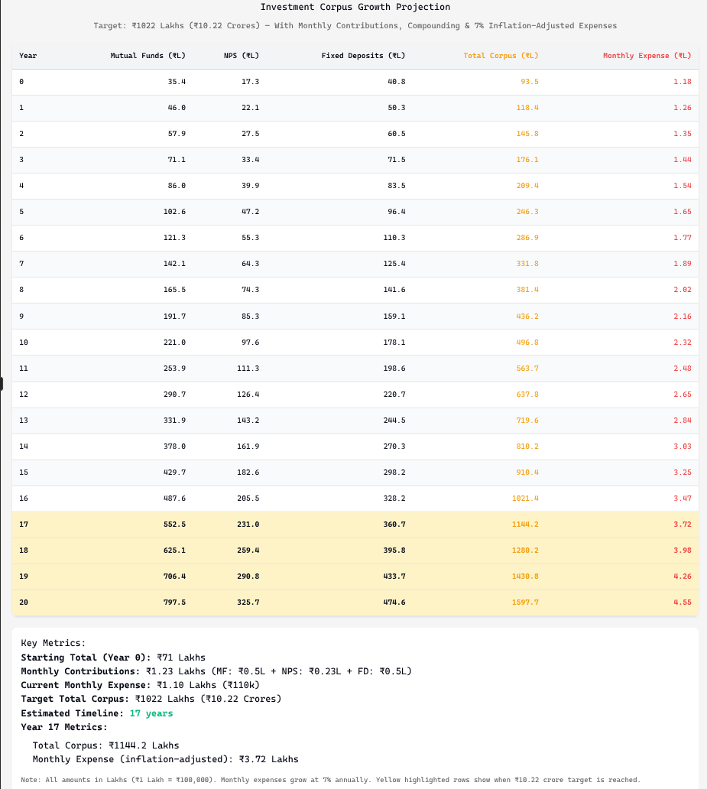

# How much money is needed for retirement?

## Problem statement
```
I am Ajay Dwivedi. 36 years old. Working in IT sector. Today is 2025-Nov-22.

Considering that today I need 110k INR per month as expenses, and the rate of inflation is 7% per year.

NOTE: Assuming 12% CAGR for Mutual Funds, 11% for NPS & 8% for EPF.

How much CORPUS I need during retirement after 20 years considering below points -
- I want to keep getting 110k INR equivalent money per month after retirement
- This 110k INR equivalent money would be coming from 5% earnings (out of 12% growth) from Mutual Funds as Systematic Withdrawl Plan (SWP)


So how much money do I need in mutual funds? I already have 2600k INR worth Mutual Funds already.

### ----------------------------------------------------------
Answer provided in: _____## Calculations - How much Corpus I need at retirement at Inflation Rate of 7% ??_____

    Need approximately ₹10.22 crore (₹102 million) at the time of retirement

```


## Summary of present corpus
```
Already in corpus = 1500k (Stocks) + 2600k (MF) + 1300k (NPS) + 3222k (EPF)
    = 8622k = 8,622 = ₹ 8.6 million

```

## Summary of Future Corpus if present corpus is kept invested for 20 years
```
### ----------------------------------------------------------
### Based on Existing Corpus: Future Value calculated from existing Corpus (Actual Calculations further below) -

    = 25.08 million (MF @ 12%) + 10.48 million (NPS @ 11%) + 14.92 million (EPF @ 8%)
    = 50.48 million
    = 5.04 crore


### ----------------------------------------------------------
### Based on Monthly Investments: Future Value calculated based on Monthly Investment (Actual Calculations further below) -

    = 50k pm (MF @ 12%) + 23k pm (NPS @ 11%) + 50k pm (EPF @ 8%)
    = 43.23 million + 17.72 million + 27.46 million
    = 88.41 million
    = 8.84 crore


### ----------------------------------------------------------
### HOW MANY YEARS TO RETIREMENT??

I have mutual funds of 2.6 million growing at cagr of 12%, nps of 1.3 million growing at cagr of 11% and fixed deposit of 3.2 million growing at cagr of 8%.
Also, I am investing yearly 0.6 million in mutual funds, 0.276 million in nps, and 0.6 million in fixed deposit.

In how many years, my investment corpus would reach 10.22 crore?
Give me tabular data for next 20 years keeping columns like Year, Mutual Funds, NPS, EPF, Total Corpus & Monthly Expense.

******** Your answer ********: You'll reach ₹10.22 crore in approximately 17 years.

```

## Investment Corpus Prediction




## Calculations - How much Corpus I need at retirement at Inflation Rate of 7% ??
```
### ----------------------------------------------------------
### Step 01: Calculate your monthly expense need at retirement

If you retire in, say, 20 years, with 7% annual inflation,
your ₹110k monthly need becomes:

₹110k × (1.07)^20 = ₹352784.90 = approximately ₹352k per month
110 * pow(1.07,20) = ₹425665.29 = approximately ₹426k per month


### ----------------------------------------------------------
### Step 02: Calculate annual withdrawal need

₹426k x 12 = ₹ 5,112,000 = ₹ 5.1 million per year


### ----------------------------------------------------------
### Step 03: Calculate corpus needed

If you're withdrawing 5% annually through SWP (meaning your corpus needs to generate that amount),
you can use this formula:

Corpus needed = Annual withdrawal need ÷ 0.05
Corpus = ₹5.1 million ÷ 0.05 = ₹ 102,240,000.0 = approximately ₹10.22 crore (₹102 million)


```


## Calculations - Future Corpus based on already accumulated funds after 20 Years
```
### ----------------------------------------------------------
### Step 01: Calculate Final Return on ****Mutual Funds**** after 20 Years at CAGR of 12%

Present Value = current Mutual Funds value = ₹ 2600k
  = ₹ 2.6 million

CAGR = 12%
Years = 20 (Dated 2025-Nov-22)

Future Value = Present Value * (1+Rate)^Years

FV = 2.6 million * pow(1.12, 20) = 25.08 million = ₹ 2.50 Crore


### ----------------------------------------------------------
### Step 02: Calculate Final Return on ****NPS**** after 20 Years at CAGR of 11%

Present Value = current NPS value = ₹ 1300K
  = ₹ 1.3 million

CAGR = 11%
Years = 20 (Dated 2025-Nov-22)

Future Value = Present Value * (1+Rate)^Years

FV = 1.3 million * pow(1.11, 20) = 10.48 million = ₹ 1.05 Crore


### ----------------------------------------------------------
### Step 03: Calculate Final Return on ****EPF**** after 20 Years at CAGR of 8.0%

Present Value = current EPF value = ₹ 3222K
  = ₹ 3.2 million

CAGR = 8%
Years = 20 (Dated 2025-Nov-22)

Future Value = Present Value * (1+Rate)^Years

FV = 3.2 million * pow(1.08, 20) = 14.92 million = ₹ 1.49 Crore
```


## Calculations - Future Corpus based on Monthly Investments after 20 Years

```
### ----------------------------------------------------------
### Step 01: Calculate Corpus with SIP on ****Mutual Funds**** after 20 Years at CAGR of 12%

Monthly SIP Amount - 50k
Annual SIP Amount = 50k * 12 = ₹ 600k

CAGR = 12%
Years = 20 (Dated 2025-Nov-22)

Future Value = Annual SIP * ( (pow(1+r, n) - 1) / r)
  = 600 * ( (pow(1+0.12, 20) - 1) / 0.12)
  = 43231 k = 43,231,000 = ₹ 43.23 million = ₹ 4.32 crore


### ----------------------------------------------------------
### Step 02: Calculate Corpus with SIP on ****NPS**** after 20 Years at CAGR of 11%

Monthly SIP Amount - 23k
Annual SIP Amount = 23k * 12 = ₹ 276k

CAGR = 11%
Years = 20 (Dated 2025-Nov-22)

Future Value = Annual SIP * ( (pow(1+r, n) - 1) / r)
  = 276 * ( (pow(1+0.11, 20) - 1) / 0.11)
  = 17719 k = 17,719,000 = ₹ 17.72 million = ₹ 1.8 crore


### ----------------------------------------------------------
### Step 03: Calculate Corpus with SIP on ****EPF**** after 20 Years at CAGR of 8%

Monthly SIP Amount - 50k
Annual SIP Amount = 50k * 12 = ₹ 600k

CAGR = 8%
Years = 20 (Dated 2025-Nov-22)

Future Value = Annual SIP * ( (pow(1+r, n) - 1) / r)
  = 600 * ( (pow(1+0.08, 20) - 1) / 0.08)
  = 27457 k = 27,457,000 = ₹ 27.46 million = ₹ 2.75 crore

```


